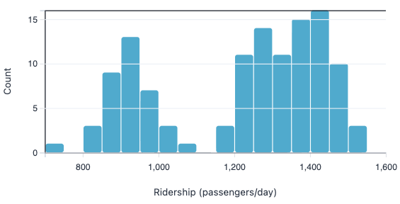
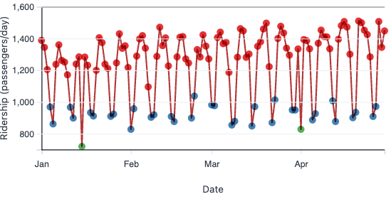
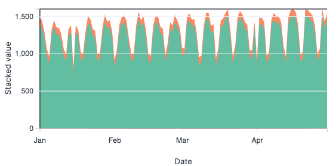
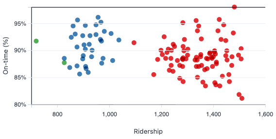

# HW2 — Visualization for Data Science
**Course:** CS-6630  
**Student:** Foad Namjoo (u1419668) · foad.namjoo@utah.edu

This repository contains three deliverables:
1) **Hand-tuned final** (root: `index.html`, `script.js`, `style.css`)  
2) **LLM system-level build** (`/llm_system`)  
3) **LLM per-visualization build** (`/llm_vis`)  

Each LLM folder includes its own `index.html`, assets, and a **full transcript** (`llm_transcript.html`) with prompts and the model’s responses.


## Thumbnails
Quick preview of the four charts (exported from the app):


<p align="center">
  
  
  
  
</p>


---

## How to run
```bash
# from repo root
python3 -m http.server 8080
# then open:
# hand-tuned (final):   http://localhost:8080/
# system-level build:   http://localhost:8080/llm_system/
# per-visualization:    http://localhost:8080/llm_vis/
